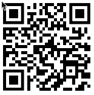

 

# EHRCON26 Clinical Modelling Workshop

### 21 September 2026 - Amsterdam
 

https://freshehrteam.github.io/ucl-training/
 

 

## Agenda

| Time          | Activity         |
| --------------| -----------------|
| 08:30 - 09:00 | Arrival and set-up |
| 09:00 - 09:15 | Welcome and introductions|
| 09:15 - 10:00 | Introduction to openEHR Clinical Modelling / ‘Unconference’ Sessions |
| 10:00 - 10:30 | **Coffee break** |
| 10:30 - 11:45 | Practical Clinical Modelling Workshop / ‘Unconference’ Sessions |
| 11:45 - 12:00 | Summary and wrap-up |
| 12:00 - 13:00 | **Lunch** |

 
 

# Practical Clinical Modelling Workshop

In this session, we will go further into the key ideas behind archetypes and templates. 

There will be a practical introduction to the openEHR Clinical Knowledge Manager and Archetype Designer clinical modelling tool, via a worked example based on a real clinical dataset.
 
 

## Getting started

- Open a web browser (Chrome or Firefox works best)

- Go to [https://tools.openehr.org/designer](https://tools.openehr.org/designer/)  (Best opened in a new tab)

- Login: 		`freshehr_training`
   Password: 	`ad4freshtraining`

- Choose the repository allocated to you – (A) Aberdeen, (B) Brechin, (C) Crieff, (D) Dundee, (E) Ellon, (F) Forfar,  (G) Glasgow, (H) Hamilton, (I) Irvine, (J) Jedburgh

- Select `Nursing Admission Assessment STARTER.v0` in the list of templates

- Open the original ['Nursing Admission Assessment paper form'](Nursing%20Admission%20Assessment.pdf) (Best opened in a new tab)

 

 

## Practical modelling tasks

### A. Tidy and extend the starter template
 

**Problem/Diagnosis**

- Rename the `Problem/Diagnosis EVALUATION archetype` to 'Main Diagnosis'

- Constrain out everything apart from 'Problem/Diagnosis name'
 

**Adverse Reaction Risk**

- Add the `Adverse reaction risk EVALUATION archetype` after 'Problem/Diagnosis'

- Set its occurrences to 0..* to allow multiple allergies to be recorded

- Constrain out everything apart from 'Substance'

- Add the `Adverse reaction event CLUSTER archetype` to the 'Reaction event summary' slot

- Constrain out everything apart from 'Specific substance' and 'Manifestation'

- Rename ‘Manifestation’ to ‘Reaction details’ and make it mandatory
 

**Medication Order**

- Clone 'Specific directions description'

- Rename one to 'Dose' and the other to 'Frequency'
 

**Vital Signs section**

- Add the `Pulse oximetry OBSERVATION archetype` into the Vital Signs template section

- Constrain out everything apart from 'SpO2' ratio

- Make 'Systolic' and 'Diastolic' in 'Blood pressure' mandatory
 

**Add Clinical Frailty Scale**

- Find the `Clinical Frailty Scale (CFS) OBSERVATION archetype` on the openEHR International CKM: [https://ckm.openehr.org/ckm/archetypes/1013.1.4691/export](https://ckm.openehr.org/ckm/archetypes/1013.1.4691/export) (Best opened in a new tab)

- Press the 'Export ADL' button and save the archetype on your system

- Go back into Archetype Designer and go to 'Import' (top menu), then either 'Browse' to find the file on your system or drag and drop it into the grey box, then click 'Upload'

- Go back to your template, click on ‘content’, then pull in the Clinical Frailty Scale from the list of archetypes on the right
 

### B. Create a new local archetype

- After reviewing the template, the end users (nurses) have asked for a new section to be added for recording some additional information on admission

- You can view the original document here: ['Additional Information on Admission'](Additional%20information%20on%20admission.pdf) (Best opened in a new tab)
 

 
 

- There is no suitable existing archetype in the CKM, so we need to create a new one to cover these additional requirements

- Create a new ADMIN_ENTRY archetype called `Inpatient admission details` and then add the following data elements:
 

**Mode of access**

			Ambulatory  	

			Wheelchair	

			Stretcher	

			Other		_________________________________
 

**Transported with**

            Oxygen
			
			Monitor	

			IV		

			Other		_________________________________
 

**Admission method**

			Waiting list
			
			Booked		

			Planned		

			A&E department	

			General Practitioner	

			Bed Bureau	

			Consultant Clinic	

			Other			____________________________		
 

**Additional Help needed**

		Yes  	     No  
 

- Once you have created your new archetype, go back to your template

- Select ‘content’, add your new archetype, and then Save the template
 

### C. From 'Form-centric' to 'Patient-centric' modelling

- Think about how we might re-organise this information into multiple templates to make it more 'patient-centric' and reduce the data entry burden for the nurses (and patients!)

- What information is about the patient in general (global) and what is about the immediate clinical context (contextual)?

- List any parts of this dataset that could be handled more globally for the patient

- Further reading: [CGEM framework](https://freshehr.notion.site/Introduction-to-the-CGEM-Framework-115ed58514b344da825c3b42c372aff2?pvs=74)

