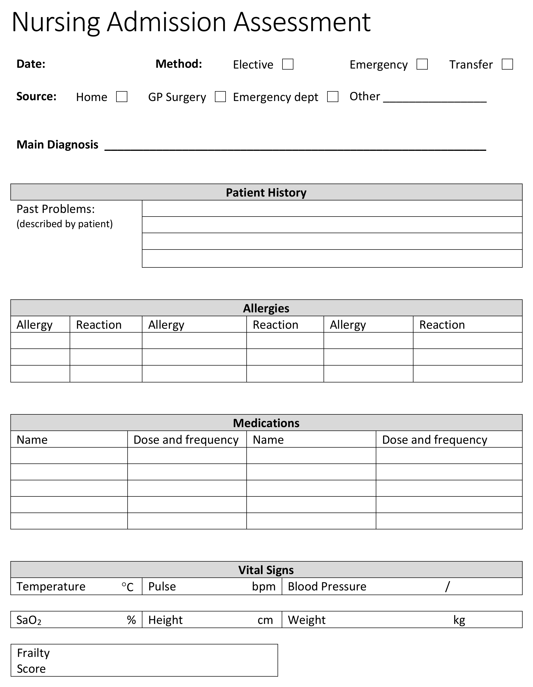
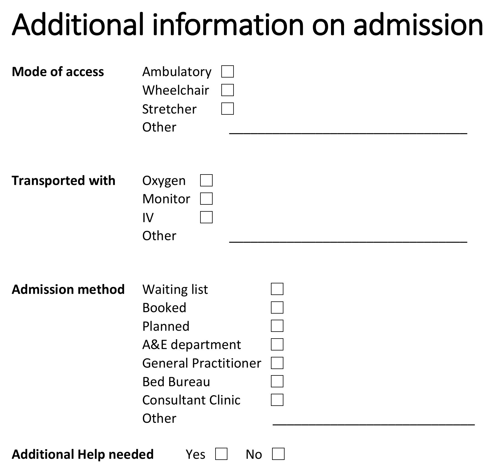

# EHRCON26 Clinical Modelling Workshop

### 21 September 2026 - Amsterdam

https://freshehrteam.github.io/openehr-workshop/

## Agenda

| Time          | Activity         |
| --------------| -----------------|
| 08:30 - 09:00 | Arrival and set-up |
| 09:00 - 09:15 | Welcome and introductions|
| 09:15 - 10:00 | Introduction to openEHR Clinical Modelling / ‘Unconference’ Sessions |
| 10:00 - 10:30 | **Coffee break** |
| 10:30 - 11:45 | Practical Clinical Modelling Workshop / ‘Unconference’ Sessions |
| 11:45 - 12:00 | Summary and wrap-up |
| 12:00 - 13:00 | **Lunch** |

## Learning objectives

By the end of this workshop, participants will be able to:

- Understand the purpose of archetypes and templates
- Navigate the openEHR CKM
- Create and modify templates in Archetype Designer
- Import, use, and design archetypes
- Apply patient-centric modelling principles

## Prerequisites

Participants should:

- Have a laptop
- Have Chrome or Firefox (or a derivative) installed
- Have access to the internet
- Possess a basic understanding of healthcare data modelling

## Terminology

A few terms used throughout this workshop:

- **Archetype** – a reusable, inclusive data model for a single clinical concept (e.g. 'Blood pressure', 'Problem/Diagnosis'), expressed in ADL. Archetypes are designed to cover every way a concept could ever be recorded, so a single one can be reused across many contexts.
- **Template** – a composition of archetypes constrained and arranged for a specific clinical use case (e.g. a nursing admission form). Templates narrow archetypes down to what's actually needed for that use case.
- **CKM (Clinical Knowledge Manager)** – the online repository where archetypes and templates are published, reviewed, and governed, so authors can search for and reuse existing clinical models instead of creating new ones.
- **Archetype Designer** – the web-based tool used in this workshop to build templates from archetypes, and to author new local archetypes.
- **Slot** – a placeholder within an archetype or template that can be filled with one or more other archetypes (e.g. a 'Reaction event summary' slot filled with an 'Adverse reaction event' CLUSTER archetype).
- **Occurrences / cardinality** – constraints on how many times a data point or archetype may appear (e.g. setting occurrences to `0..*` on 'Adverse reaction risk' allows any number of allergies to be recorded).

## Practical Clinical Modelling Workshop

In this session, we will go further into the key ideas behind archetypes and templates.

There will be a practical introduction to the openEHR Clinical Knowledge Manager and Archetype Designer clinical modelling tool, via a worked example based on a real clinical dataset.

### Getting started

- Open a web browser (Chrome or Firefox works best)
- Go to [https://tools.openehr.org/designer](https://tools.openehr.org/designer/) (best opened in a new tab)
- Login: `freshehr_training`
- Password: `ad4freshtraining`
- Choose the repository allocated to you – (A) Aberdeen, (B) Brechin, (C) Crieff, (D) Dundee, (E) Ellon, (F) Forfar, (G) Glasgow, (H) Hamilton, (I) Irvine, (J) Jedburgh
- Select `Nursing Admission Assessment STARTER.v0` in the list of templates
- Open the original ['Nursing Admission Assessment paper form'](Nursing%20Admission%20Assessment.pdf) (best opened in a new tab)

### Practical modelling tasks

#### A. Tidy and extend the starter template

A starter template is rarely fit for purpose as-is: archetypes are deliberately broad so they can be reused everywhere, so the job of template design is narrowing each one down to what this specific form needs, and pulling in extra archetypes for what it's still missing.

**Problem/Diagnosis**

Renaming and constraining the archetype to just what's needed keeps the form focused on what the clinician actually has to record, without hiding that the underlying archetype still supports the fuller concept elsewhere.

- Rename the `Problem/Diagnosis EVALUATION archetype` to 'Main Diagnosis'
- Constrain out everything apart from 'Problem/Diagnosis name'

**Adverse Reaction Risk**

Patients often have more than one allergy, so the archetype needs to repeat; reusing the 'Adverse reaction event' CLUSTER for each reaction, rather than modelling it again, is the reuse principle in action, and making the reaction detail mandatory avoids an unsafe blank entry for a safety-critical field.

- Add the `Adverse reaction risk EVALUATION archetype` after 'Problem/Diagnosis'
- Set its occurrences to 0..* to allow multiple allergies to be recorded
- Constrain out everything apart from 'Substance'
- Add the `Adverse reaction event CLUSTER archetype` to the 'Reaction event summary' slot
- Constrain out everything apart from 'Specific substance' and 'Manifestation'
- Rename ‘Manifestation’ to ‘Reaction details’ and make it mandatory

**Medication Order**

Cloning an existing data element instead of authoring a new one shows how a single archetype element can be reused twice within the same template for two different purposes.

- Clone 'Specific directions description'
- Rename one to 'Dose' and the other to 'Frequency'

**Vital Signs section**

Pulling in a second OBSERVATION archetype (pulse oximetry) alongside blood pressure shows how a template section aggregates several independent archetypes into one clinical picture, while making systolic/diastolic mandatory demonstrates enforcing data completeness at the template level without changing the archetype itself.

- Add the `Pulse oximetry OBSERVATION archetype` into the Vital Signs template section
- Constrain out everything apart from 'SpO2' ratio
- Make 'Systolic' and 'Diastolic' in 'Blood pressure' mandatory

**Add Clinical Frailty Scale**

This walks through the full reuse workflow that CKM is built around: search CKM first, and only author something new if nothing suitable already exists.

- Find the `Clinical Frailty Scale (CFS) OBSERVATION archetype` on the openEHR International CKM: [https://ckm.openehr.org/ckm/archetypes/1013.1.4691/export](https://ckm.openehr.org/ckm/archetypes/1013.1.4691/export) (best opened in a new tab)
- Press the 'Export ADL' button and save the archetype on your system
- Go back into Archetype Designer and go to 'Import' (top menu), then either 'Browse' to find the file on your system or drag and drop it into the grey box, then click 'Upload'
- Go back to your template, click on ‘content’, then pull in the Clinical Frailty Scale from the list of archetypes on the right

#### B. Create a new local archetype

After reviewing the template, the end users (nurses) have asked for a new section to be added for recording some additional information on admission.

You can view the original document here: ['Additional Information on Admission'](Additional%20information%20on%20admission.pdf) (best opened in a new tab)

There is no suitable existing archetype in the CKM for this data, so, having exhausted the reuse-first step, we author a new one. It's modelled as an `ADMIN_ENTRY` rather than an `OBSERVATION` or `EVALUATION` because this is admission logistics, not a clinical finding.

- Create a new ADMIN_ENTRY archetype called `Inpatient admission details` and then add the following data elements:

**Mode of access**

- Ambulatory
- Wheelchair
- Stretcher
- Other: `_________________________________`

**Transported with**

- Oxygen
- Monitor
- IV
- Other: `_________________________________`

**Admission method**

- Waiting list
- Booked
- Planned
- A&E department
- General Practitioner
- Bed Bureau
- Consultant Clinic
- Other: `____________________________`

**Additional Help needed**

- Yes
- No

Once you have created your new archetype, go back to your template:

- Select ‘content’, add your new archetype, and then Save the template

#### C. From 'Form-centric' to 'Patient-centric' modelling

A form models one encounter, but much of what it captures (like a patient's general mobility or preferred language) doesn't change between encounters and shouldn't need re-entering every time. Recognising which data is patient-level versus context-level is what lets a template be replaced by several smaller, reusable ones.

- Think about how we might re-organise this information into multiple templates to make it more 'patient-centric' and reduce the data entry burden for the nurses (and patients!)
- What information is about the patient in general (global) and what is about the immediate clinical context (contextual)?
- List any parts of this dataset that could be handled more globally for the patient
- Further reading: [CGEM framework](https://freshehr.notion.site/Introduction-to-the-CGEM-Framework-115ed58514b344da825c3b42c372aff2?pvs=74)
